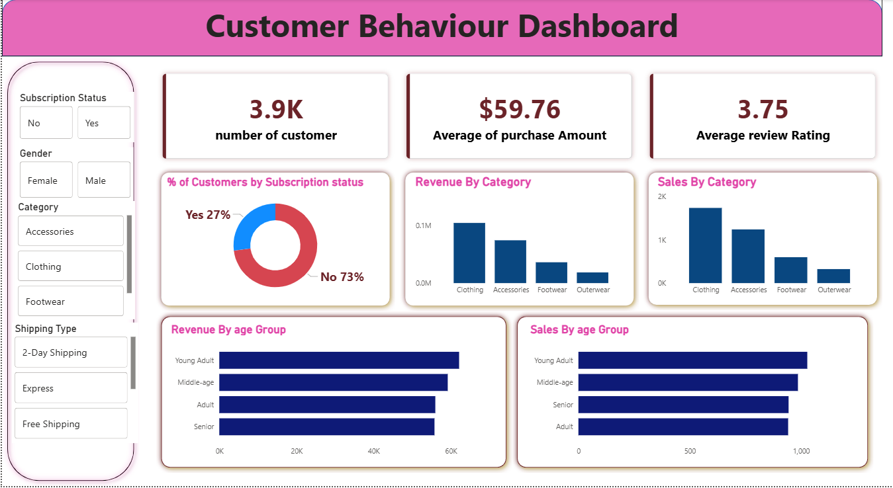

# customer_Behaviour-Analysis
customer Behaviour Analysis using SQL, Python &amp; Power BI
# Customer Behaviour Analysis Dashboard

## Project Overview
This project analyzes customer purchasing behavior, sales trends, and customer segmentation using SQL, Python, and Power BI.

## Tools & Technologies
- SQL
- Python
- Power BI
- Excel
- Pandas
- Matplotlib

## Key Insights
- Identified high-value customer segments
- Analyzed repeat purchase behavior
- Evaluated regional sales performance
- Built interactive Power BI dashboard

## Dashboard Screenshots

### Dashboard

## Project Files
- SQL queries for analysis
- Python scripts for data cleaning & EDA
- Interactive Power BI dashboard (.pbix)
- Dataset files

## Author
Suraj Pathak
